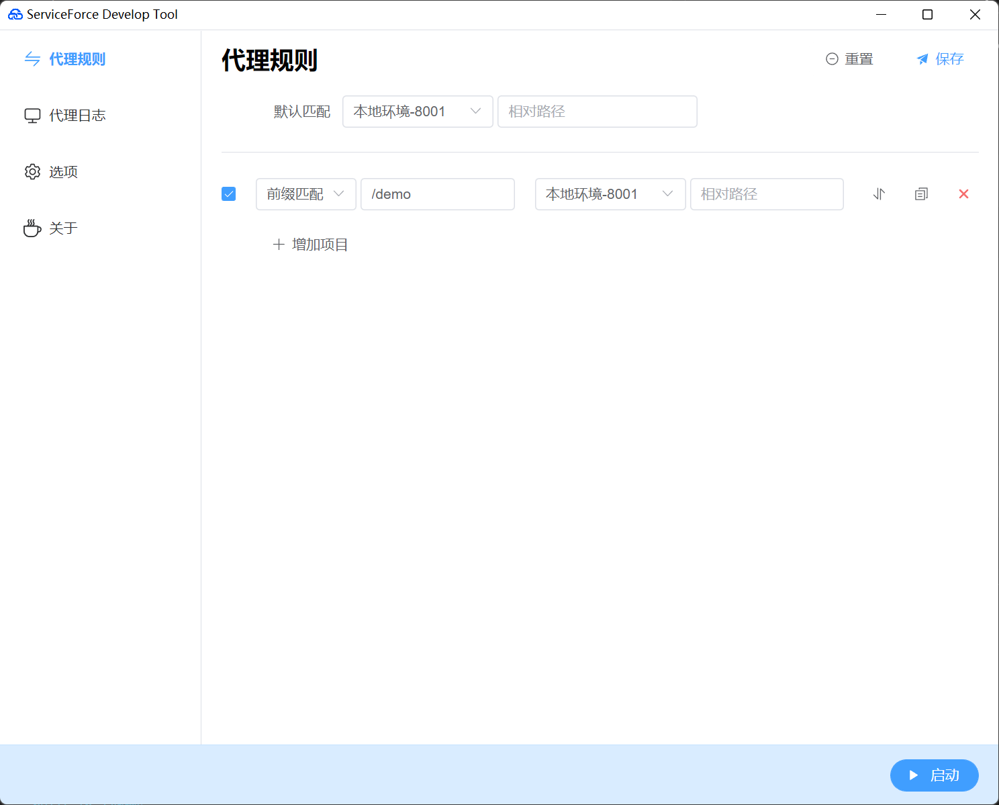

# ServiceForce Develop Tool

基于 electron + vite + vue3 + pnpm + typescript 构建的桌面应用，助力前端开发

---



## 文档

[https://tjyuanpeng.github.io/dev-tools/](https://tjyuanpeng.github.io/dev-tools/)

## 下载

[https://github.com/tjyuanpeng/dev-tools/releases](https://github.com/tjyuanpeng/dev-tools/releases)

## 安装依赖

```
pnpm i
```

## 开发

```
pnpm run dev
```

## 构建

```
pnpm run build
```

## 文档开发

```
pnpm run docs:dev
```
