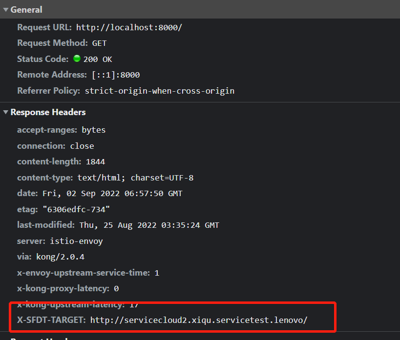

# 代理规则

代理功能提供了一个独立于前端项目的 http/https/websocket 的代理

前端项目当中的 webpack-dev-server 的代理功能，只提供当前项目的前端资源和 api 接口的代理服务

而 sfdt 的代理，提供了全局代理的功能

无需重启开发进程，代理规则实时生效

## 字段

|     名称 | 说明                                                                                                                                                      |
| -------: | :-------------------------------------------------------------------------------------------------------------------------------------------------------- |
|     启用 | 该规则是否生效                                                                                                                                            |
| 匹配模式 | 规则匹配的方式<br>可选项：前缀匹配， 精确匹配，正则匹配                                                                                                   |
|     from | 前缀匹配时，指定匹配的前缀，必须以`\`开头<br>精确匹配时，指定完整的 URL path，必须以`\`开头<br>正则匹配时，必须为合法的正则表达式                         |
|     环境 | 选择要代理到的环境<br>从`选项`页面中配置环境选项<br>可以选择`自定义`模式， URL 由路径字段完全指定                                                         |
|     路径 | 指定要代理到环境的 path<br>例如，环境 url ：`http://test.com`，路径：`foo`<br>代理到的 URL：`http://test.com/foo`<br>`自定义`模式下，路径必须为完整的 URL |

## 真实 URL 地址

为了更好的找到每个请求的真实 URL
在每个请求的 response header 中，增加了`X-SFDT-TARGET `
内容为真实请求的 URL 地址



## 操作

| 名称 | 说明                     |
| ---: | :----------------------- |
| 拖动 | 拖动图标来改变规则的顺序 |
| 复制 | 拷贝当前规则为一条新规则 |
| 删除 | 删除规则                 |

## 顺序

规则是由上到下生效的

一个请求匹配到一条规则后，下面的规则会被忽略

可以通过`拖动排序`图标来改变规则顺序

## 重置

放弃当前为保存的修改，还原到未修改的状态

## 快捷键

`(ctrl or cmd) + s`：保存配置

## YAPI mock

选择前缀匹配模式

设置需要拦截的接口

选择 `YAPI mock` 环境

在路径中，填入`项目ID`

保存配置

## 常见问题

### 为什么开启代理后，无法打开子应用页面，显示 `You need to export the functional lifecycles in xxx entry`

删除子应用 vue-cli 配置文件中，关于`globalObject`的配置，建议先注释掉

> 检查微应用的 webpack 是否配置了 output.globalObject 的值，如果有请确保其值为 window，或者移除该配置从而使用默认值。

详见：[qiankun FAQ](https://qiankun.umijs.org/zh/faq#application-died-in-status-loading_source_code-you-need-to-export-the-functional-lifecycles-in-xxx-entry)

#### ./vue.config.js

```js
output: {
  library: `${packageName}-[name]`,
  libraryTarget: 'umd',
  jsonpFunction: `webpackJsonp_${packageName}`
  //  globalObject: 'this'
}
```

### 为什么选择环境配置为 uat 或者 sit 时，代理规则的地址打不开

可能是环境配置中的 URL 是 http 地址

建议升级最新版程序，并且清除用户数据后(`关于` 页面中的 `Reset User Data` 按钮)，还原最新的环境配置

或者手动把 SIT、UAT、线上环境的地址改为 https 协议

### 相对路径显示错误

代理规则的相对路径显示错误，或者没有及时更新，或者显示空

这是 vue3 响应式 bug 引起的

临时解决方案是重新加载页面(`关于` 页面中的 `Reload Window` 按钮)

### mac 下，本地的代理地址无法访问

mac 下，localhost 没有映射到本地

请在 host 中增加配置规则

```
127.0.0.1 localhost
```
